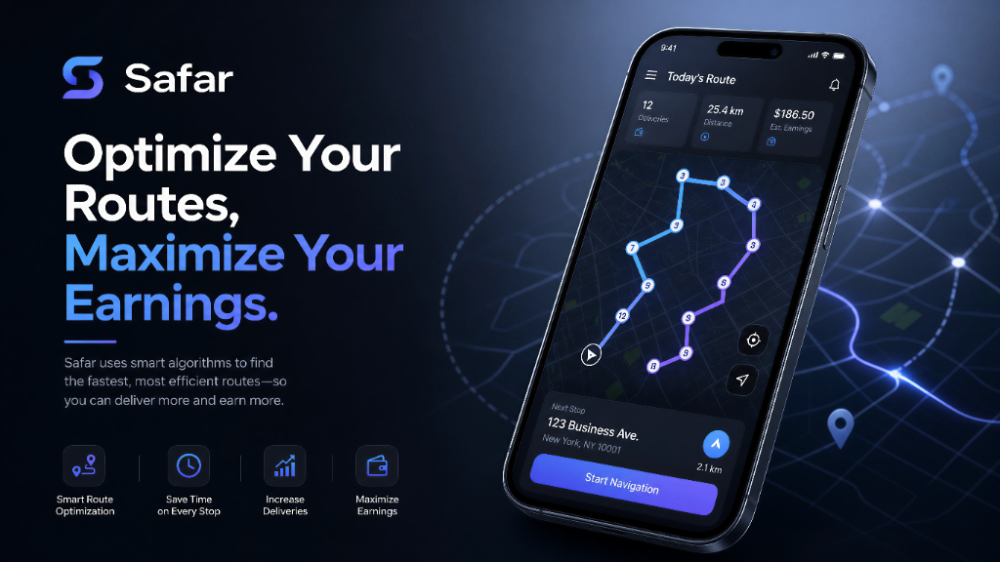

# 📍 Safar

### **Optimize Your Routes, Save Time, and Maximize Your Earnings.**
Safar is the ultimate SaaS routing solution built for delivery drivers, courier agents, e-commerce workers, and modern travellers. Turn chaos into optimized paths, reduce fuel costs, and navigate your day with confidence.

🔗 **Try Safar Live:** [Safar-app.vercel.app](https://Safar-app.vercel.app) 

---

## 🚀 Why Safar?

Planning multi-stop delivery routes manually is slow, frustrating, and costs you money in fuel and lost time. Safar automates route organization and lets you instantly launch your customized paths directly into Google Maps for turn-by-turn navigation.

* **Save up to 30% on Fuel & Time:** Let Safar structure your day.
* **Launch Instantly:** Zero copy-pasting address lists. One click triggers complete navigation.
* **Designed for the Road:** Mobile-optimized, ultra-responsive layout with a premium battery-saving Dark Slate theme.

---

## ✨ Premium Features

### 🔍 Smart Address Autocomplete
Powered by industry-leading Google Places API. Search and select any address instantly with automatic geocoding.

### 🌓 Premium Dark Mode
Switch between high-contrast light and dark themes. The premium Dark Slate theme is specifically optimized for delivery dashboards, reducing eye strain and saving battery life during long shifts.

### 📍 Intelligent Starting Points
Configure default locations (such as home base, warehouse, or regional hubs like Agarpara) to instantly begin crafting new routes without repetitive typing.

### 🧑‍💼 Tailored Experience for Every Role
Get custom workflows whether you are:
* **🛵 Food Delivery Workers** (Zomato, Swiggy, UberEats, etc.)
* **📦 Parcel & Courier Agents** (Amazon, DHL, FedEx, etc.)
* **🏭 E-commerce Operations Employees**
* **✈️ Travellers & Tour Planners**

### 📱 Full Offline Capabilities
Built as a Progressive Web App (PWA). If you briefly lose signal or drive through low-connectivity areas, your active routes remain fully loaded and responsive.

---

## ⚡ How It Works

Getting started with Safar takes less than a minute:

1. **Sign Up / Guest Mode:** Create a secure account to sync your routes across devices, or start planning instantly in guest mode.
2. **Add Your Destinations:** Simply type address names or coordinates for your starting point and stops.
3. **Organize & Optimize:** Arrange stops in the optimal order using intuitive drag-and-drop lists.
4. **Launch & Drive:** Tap **Launch in Maps** to open the entire route instantly in your Google Maps app.

---

## 🔒 Proprietary Software & Terms

**Safar is a proprietary Software-as-a-Service (SaaS) product.** 
* All rights reserved. 
* Downloading, copying, self-hosting, or distributing the source code of this application is strictly prohibited under intellectual property laws.
* For enterprise partnerships, custom API integrations, or licensing inquiries, please contact the product team.

---

*Copyright © 2026 Safar. All rights reserved.*
